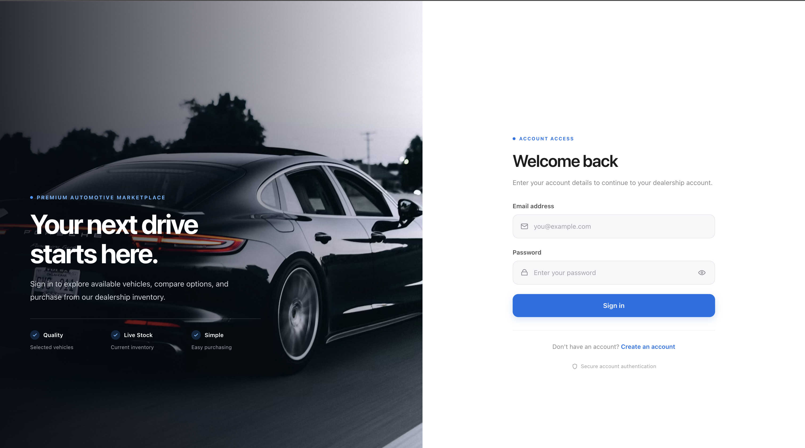
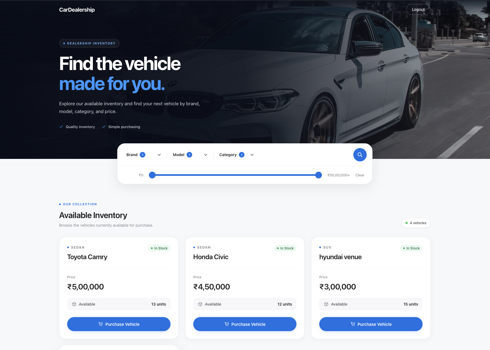
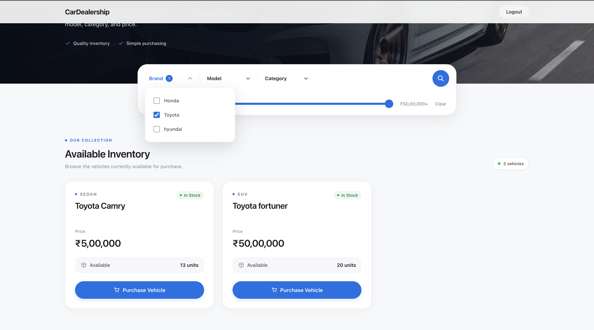
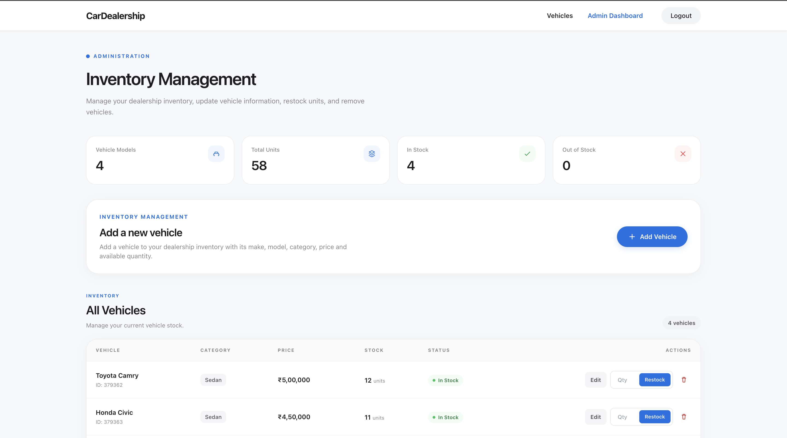

# Car Dealership Inventory Management System

A full-stack car dealership inventory management application built with React, Node.js, Express, MongoDB, and TypeScript.

The application provides separate functionality for customers and administrators. Users can register, log in, browse the available inventory, search for vehicles, and purchase them. Administrators have additional access to manage the inventory by adding, updating, deleting, and restocking vehicles.

The main purpose of this project was to build a complete full-stack application while focusing on authentication, role-based authorization, REST APIs, inventory management, validation, and automated testing.

---

## Live Application and Repository

The application is fully deployed, with the React frontend hosted on Vercel and the Node.js/Express API hosted on Render.

- **Live Application:** https://car-dealership-inventory-system-ten-sigma.vercel.app/
- **Backend API:** https://car-dealership-inventory-system-pvrr.onrender.com
- **Source Code:** https://github.com/sumitkumar62847/car-dealership-inventory-system
- **AI Tooling History:** [PROMPTS.md](./PROMPTS.md)

---

## Features

### User Features

- Register and log in
- JWT-based authentication
- Protected routes
- Browse available vehicles
- Search and filter vehicles
- Filter by brand, model, category, and price
- View vehicle price and available quantity
- Purchase available vehicles
- Automatic stock update after purchase
- Out-of-stock handling

### Admin Features

- Role-based admin access
- Admin dashboard
- View inventory statistics
- Add new vehicles
- Update vehicle information
- Delete vehicles
- Restock inventory
- View current stock status

---


## Application Screenshots

The following screenshots show the main flows of the final application.

### Login



### User Dashboard



### Search and Filtering



### Admin Dashboard



---

## Tech Stack

### Frontend

- React.js
- React Router
- Axios
- Tailwind CSS
- Context API
- JWT Decode
- Jest
- React Testing Library

### Backend

- Node.js
- Express.js
- TypeScript
- MongoDB
- Mongoose
- JSON Web Token (JWT)
- bcrypt
- Jest
- Supertest

---

## Project Structure

```text
car-dealership/
│
├── backend/
│   ├── src/
│   │   ├── controllers/
│   │   ├── middleware/
│   │   ├── models/
│   │   ├── routes/
│   │   ├── services/
│   │   └── app.ts
│   │
│   ├── tests/
│   ├── package.json
│   └── tsconfig.json
│
├── frontend/
│   ├── public/
│   ├── src/
│   │   ├── components/
│   │   │   ├── Navbar.jsx
│   │   │   ├── VehicleCard.jsx
│   │   │   ├── SearchBar.jsx
│   │   │   ├── VehicleForm.jsx
│   │   │   └── ProtectedRoute.jsx
│   │   │
│   │   ├── context/
│   │   │   └── AuthContext.jsx
│   │   │
│   │   ├── pages/
│   │   │   ├── Login.jsx
│   │   │   ├── Register.jsx
│   │   │   ├── Dashboard.jsx
│   │   │   └── AdminDashboard.jsx
│   │   │
│   │   ├── services/
│   │   │   └── api.jsx
│   │   │
│   │   └── App.js
│   │
│   └── package.json
│
├── screenshots/
│   ├── login.png
│   ├── dashboard.png
│   ├── search.png
│   └── admin-dashboard.png
│
├── README.md
├── PROMPTS.md
└── .gitignore
```

---

## Authentication and Authorization

The application uses JSON Web Tokens (JWT) for authentication.

After a successful login, the backend generates a token containing information about the authenticated user.

Example JWT payload:

```json
{
  "userId": "USER_ID",
  "role": "user"
}
```

On the frontend, authentication state is managed using `AuthContext`.

Protected routes check whether a user is authenticated before allowing access to restricted pages.

Admin routes additionally check the user's role:

```text
role === "admin"
```

Authorization is also enforced on the backend using authentication and admin middleware. Frontend route protection is therefore not the only security layer protecting admin operations.

---

## Vehicle Inventory

A vehicle contains information such as:

```json
{
  "make": "Toyota",
  "model": "Fortuner",
  "category": "SUV",
  "price": 45000,
  "quantity": 5
}
```

Administrators can manage these vehicles through the Admin Dashboard, while regular users can browse and purchase available vehicles from the main Dashboard.

---

## Search and Filtering

The inventory can be filtered using:

- Brand
- Model
- Category
- Minimum price
- Maximum price

The available model options depend on the selected brand. For example, after selecting Toyota, the model filter displays Toyota models available in the inventory.

Search requests are sent to the backend, which handles the filtering and returns the matching vehicles.

---

## Vehicle Purchase

Authenticated users can purchase vehicles that are currently in stock.

```http
POST /api/vehicles/:id/purchase
```

When a purchase succeeds, the available quantity is reduced by one.

For example:

```text
Before purchase

Toyota Fortuner
Quantity: 5

        ↓ Purchase

After purchase

Toyota Fortuner
Quantity: 4
```

If the quantity has reached zero, the backend prevents another purchase.

The stock reduction is performed using an atomic MongoDB update. This ensures the quantity is decreased only when stock is available.

---

## Vehicle Restocking

Administrators can increase the available quantity of an existing vehicle.

```http
POST /api/vehicles/:id/restock
```

Example:

```text
Current quantity: 5
Restock quantity: 3

New quantity: 8
```

Restocking is protected by admin authorization.

---

## API Endpoints

### Authentication

| Method | Endpoint | Description |
|--------|----------|-------------|
| POST | `/api/auth/register` | Register a new user |
| POST | `/api/auth/login` | Login and receive a JWT |

### Vehicles

| Method | Endpoint | Access | Description |
|--------|----------|--------|-------------|
| GET | `/api/vehicles` | Authenticated | Get all vehicles |
| GET | `/api/vehicles/search` | Authenticated | Search and filter vehicles |
| POST | `/api/vehicles` | Admin | Add a new vehicle |
| PUT | `/api/vehicles/:id` | Admin | Update a vehicle |
| DELETE | `/api/vehicles/:id` | Admin | Delete a vehicle |
| POST | `/api/vehicles/:id/purchase` | Authenticated | Purchase a vehicle |
| POST | `/api/vehicles/:id/restock` | Admin | Restock a vehicle |

For protected endpoints, the JWT is sent using the authorization header:

```http
Authorization: Bearer <token>
```

---

## Validation

The backend validates incoming data before making changes to the database.

Some of the validation and business rules include:

- Make is required
- Model is required
- Category is required
- Price cannot be negative
- Quantity cannot be negative
- Restock quantity must be greater than zero
- Out-of-stock vehicles cannot be purchased
- Protected endpoints require authentication
- Admin operations require admin privileges

Validation is handled on the server even when similar checks exist on the frontend.

---

## Running the Project Locally

### Prerequisites

Make sure you have the following installed:

- Node.js
- npm
- MongoDB locally or a MongoDB Atlas database
- Git

### 1. Clone the Repository

```bash
git clone https://github.com/sumitkumar62847/car-dealership-inventory-system.git
cd car-dealership-inventory-system
```

---

### 2. Backend Setup

Move into the backend directory:

```bash
cd backend
```

Install the dependencies:

```bash
npm install
```

Create a `.env` file inside the `backend` directory:

```env
PORT=5001
MONGODB_URI=your_mongodb_connection_string
JWT_SECRET=your_jwt_secret
```

Do not commit your real `.env` file or secrets to GitHub.

Start the backend development server:

```bash
npm run dev
```

The backend should run on:

```text
http://localhost:5001
```

---

### 3. Frontend Setup

Open another terminal and move into the frontend directory:

```bash
cd frontend
```

Install the dependencies:

```bash
npm install
```

Start the React development server:

```bash
npm start
```

The frontend should run on:

```text
http://localhost:3000
```

Make sure the backend is also running when using functionality that requires the API.

---

## Test Report

Automated tests are included for both the backend and frontend.

### Backend Tests

Backend tests use Jest and Supertest.

Run the backend tests with:

```bash
cd backend
npm test
```

The backend suite verifies the API, authentication/authorization middleware, inventory operations, validation, and error responses. The final test output can be reproduced locally with the command above.

The backend tests cover important functionality including:

- Registration and login
- JWT authentication
- Authentication middleware
- Admin authorization
- Vehicle creation
- Retrieving vehicles
- Updating vehicles
- Deleting vehicles
- Search and filtering
- Vehicle purchases
- Vehicle restocking
- Input validation
- Error responses

---

### Frontend Tests

Frontend tests use Jest and React Testing Library.

Run all tests:

```bash
cd frontend
npm test -- --watchAll=false
```

Run the tests with coverage:

```bash
npm test -- --coverage --watchAll=false
```

Current frontend test results:

```text
Test Suites: 9 passed, 9 total
Tests:       93 passed, 93 total
Snapshots:   0 total
```

### Frontend Test Coverage

| Metric | Coverage |
|--------|----------|
| Statements | 78.46% |
| Branches | 75.33% |
| Functions | 68.98% |
| Lines | 78.75% |

The frontend tests cover the main application flows and components, including:

- Login
- Registration
- Authentication context
- Protected routes
- Vehicle cards
- Search and filtering
- Vehicle forms
- User Dashboard
- Admin Dashboard
- Vehicle purchases
- Adding vehicles
- Updating vehicles
- Deleting vehicles
- Restocking inventory

The focus of the tests is on application behavior rather than simply increasing the coverage percentage.

---

## Error Handling

The application handles common validation, authentication, and API errors.

Examples include:

- Invalid login credentials
- Unauthorized requests
- Vehicle not found
- Vehicle out of stock
- Invalid vehicle information
- Invalid restock quantity
- API/network errors

The frontend also displays loading states while asynchronous operations are running.

---

## Security

Some of the security practices used in the project include:

- Password hashing
- JWT authentication
- Protected API endpoints
- Role-based authorization
- Authentication middleware
- Admin authorization middleware
- Server-side input validation
- Environment variables for sensitive configuration

Sensitive values such as the MongoDB connection string and JWT secret are stored in environment variables instead of being hard-coded into the application.

---

## My AI Usage

I used ChatGPT as a development assistant while building and improving this project. AI was used as a supporting tool for discussing implementation approaches, debugging errors, reviewing code, improving automated tests, and troubleshooting build and deployment issues.

Some of the areas where AI assistance was useful included:

- debugging frontend and backend test failures
- understanding Jest, Supertest, and React Testing Library errors
- improving test cases for important application flows
- resolving TypeScript build and type errors
- reviewing authentication, authorization, and inventory logic
- troubleshooting frontend and backend deployment configuration
- improving project documentation and README organization

I did not treat AI-generated suggestions as automatically correct or as finished code. Suggestions were reviewed against the existing project, adapted where necessary, and verified by running builds, tests, API requests, and the deployed application. In several cases, suggested changes required additional debugging before they worked correctly with the project.

The complete AI tooling conversation and prompts used during development are documented in [PROMPTS.md](./PROMPTS.md).

---

## What I Learned

Building this project gave me practical experience working on a complete application from the API layer to the frontend.

Some of the main things I worked with were:

- Structuring a React and Node.js application
- Designing REST APIs with Express
- Working with MongoDB and Mongoose
- Implementing JWT authentication
- Building role-based authorization
- Managing authentication state with React Context
- Connecting React to REST APIs with Axios
- Implementing inventory management
- Handling stock updates safely
- Building dependent search filters
- Writing backend integration tests with Jest and Supertest
- Writing frontend tests with React Testing Library
- Mocking API calls in frontend tests
- Testing loading, success, validation, and error states

One thing I focused on while building the project was keeping important business rules on the backend. The frontend provides validation and feedback for a better user experience, but the backend still verifies authentication, authorization, stock availability, and request data before modifying the database.

---

## Future Improvements

There are several features that could be added as the project grows:

- Vehicle image uploads
- Pagination for larger inventories
- Additional sorting options
- Purchase history
- User profile management
- Admin activity history
- Inventory analytics
- Email notifications
- End-to-end testing
- CI/CD workflow

---

## Author

**Sumit Kumar**

B.Tech Computer Science student and MERN stack developer, currently focusing on backend development with Node.js, Express.js, MongoDB, and REST APIs.